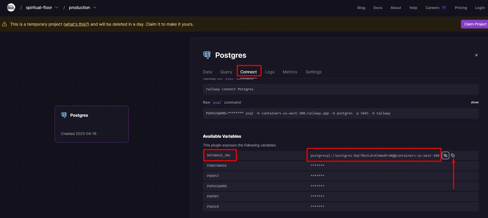
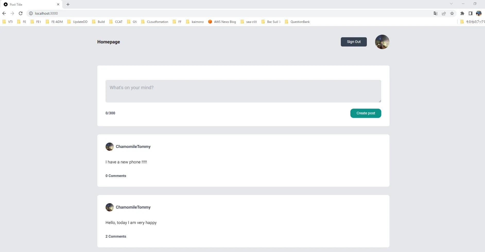

# Post Project

Project with CRUD for Posts


## PostgreSQL DB

To create PostgreSQL DB:
- We go to https://railway.app/ 
- Click "Start new project"
- Click "Provision PostgreSQL"
- Copy DATABASE_URL



## Run Locally

Clone the project

```bash
  git clone https://github.com/ChamomileTommy/Posts-Project.git
```

Go to the project directory

```bash
  cd Posts-Project
```

Install dependencies

```bash
  npm install
```

Config .env

```bash
  DATABASE_URL=""
  GITHUB_ID=""
  GITHUB_SECRET=""
  GOOGLE_CLIENT_ID=""
  GOOGLE_CLIENT_SECRET=""
```

Create table for PostgreSQL DB

```bash
  npx prisma migrate dev
```

Start the server

```bash
  npm run dev
  #Run on http://localhost:3000/
```


## Demo



## 🚀 About Me
I'm a full stack developer for 4 years
